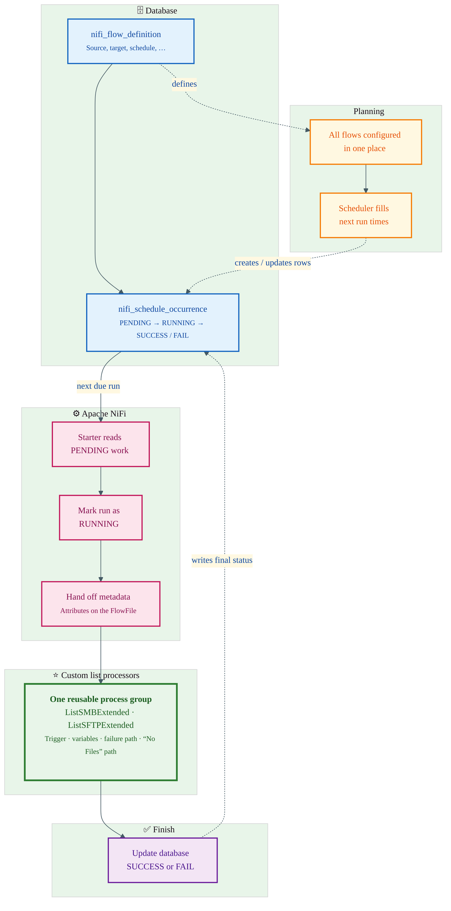

# Batch processing flow

Short guide for **non-technical** readers. Optional diagram at the end for slides or documentation tools that support Mermaid.

---

## How this flow works (plain language)

- **One place for configuration**  
  Each batch flow (where data comes from, where it goes, when it runs, and other settings) is stored in a central table: **`nifi_flow_definition`**. Think of it as the “recipe book” for all similar jobs.

- **The schedule is written in advance**  
  Using the timing rules from that configuration, the system fills another table — **`nifi_schedule_occurrence`** — with one row per run that should happen. New rows start as **“waiting to start”** (*PENDING*).

- **NiFi picks up work when it is due**  
  A small automated step in **Apache NiFi** (your integration platform) reads the schedule table, finds runs that are **waiting**, and starts the right job. When a run starts, that row is marked as **“in progress”** (*RUNNING*).

- **One reusable template for many flows**  
  Instead of building dozens of separate NiFi diagrams, you use **one reusable process group** — the same steps, driven by the data passed in for each run (source, target, paths, and so on).

- **Custom “list” steps fix standard limitations**  
  Inside that template, **custom list processors** (for SMB and SFTP) connect to remote folders using those passed-in details. They can signal **success**, **no files to process**, or **failure** clearly — so operations and downstream steps always know what happened.

- **The database is updated when the run ends**  
  When the NiFi flow finishes, the matching row in **`nifi_schedule_occurrence`** is updated to **completed successfully** (*SUCCESS*) or **completed with a problem** (*FAIL*). That gives you a clear history of what ran and how it ended.

---

## Diagram (optional)

---

## One sentence you can paste into an email

**We store all flow settings and schedules in the database; NiFi starts each run when it is due, using one shared template and custom list steps so we always know if files were found, nothing was there, or something failed — then we write the final status back to the database.**
