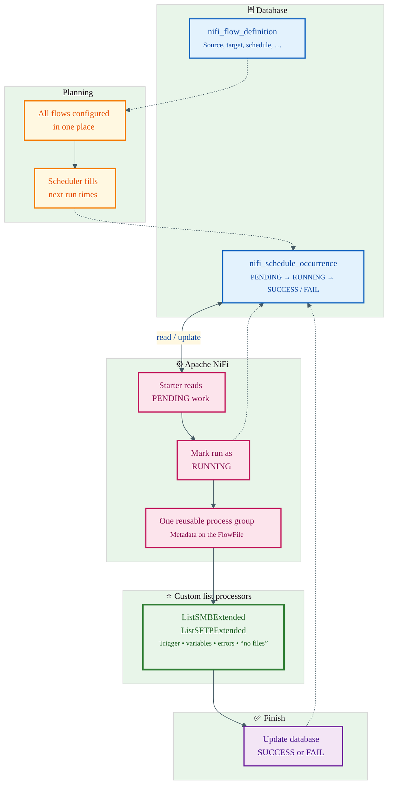

# Batch processing flow — visual guide

Use this file for **stakeholder-friendly** diagrams. The Mermaid block below uses **colors and short labels** so it reads well in GitHub, GitLab, Notion, or [Mermaid Live Editor](https://mermaid.live).

---

## Draw.io vs other tools (quick recommendation)

| Tool | Best for | Mermaid paste |
|------|-----------|----------------|
| **[Mermaid Live](https://mermaid.live)** | **Best first step** — paste code, pick theme, export **SVG** or **PNG** with consistent colors | Native — looks as designed |
| **Draw.io (diagrams.net)** | Manual polish, exact branding, drag icons | Mermaid is **imported as editable shapes**; **theme/colors often look plain or differ** from Mermaid Live — not a bug, just different engine |
| **GitHub / GitLab** | Docs next to code | Renders Mermaid in `.md` files well |
| **Notion / Confluence** | Wikis for mixed audiences | Good Mermaid support |
| **Excalidraw** | Workshops, “sketch” feel | No Mermaid — draw by hand or **paste SVG** exported from Mermaid Live |

**Practical workflow for Draw.io:** paste the diagram in **Mermaid Live** → **Actions → Export SVG** → in Draw.io **File → Import** the SVG. You keep the colors and can still add logos/text boxes on top.

---

## Colored flowchart (copy everything inside the fence)

Paste into [mermaid.live](https://mermaid.live) for the nicest preview, or into any Markdown viewer that supports Mermaid.

---

## Why Draw.io can look “wrong” with Mermaid

- Draw.io **translates** Mermaid into its own shapes; not every Mermaid style or `classDef` maps 1:1.
- Long labels in one line can **stretch boxes** — the diagram above uses ` ` and `<small>` for cleaner layout where supported.

If you need **pixel-perfect** slides, export **SVG from Mermaid Live** and import into Draw.io (or PowerPoint).

---

## One-line summary (for slides)

**Database holds definitions and schedule rows → NiFi picks up due work → custom list processors run with that metadata → database records SUCCESS or FAIL.**
